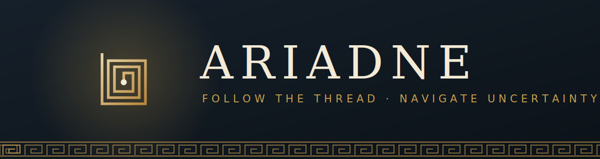
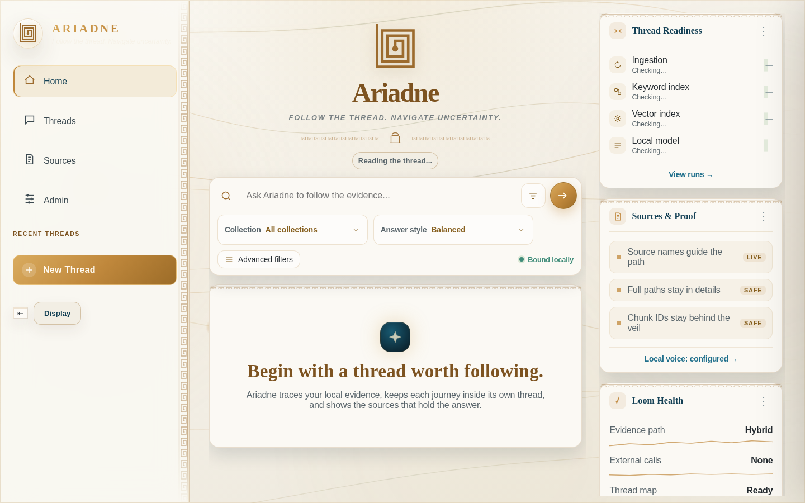
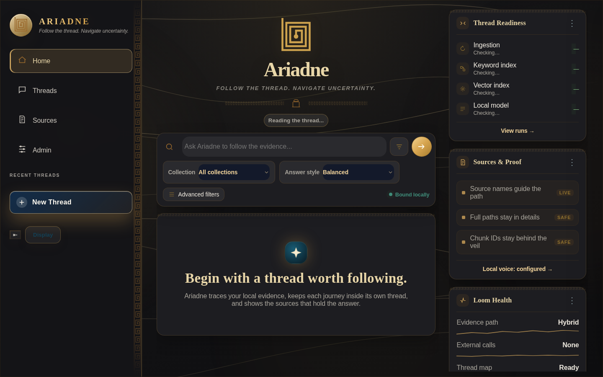
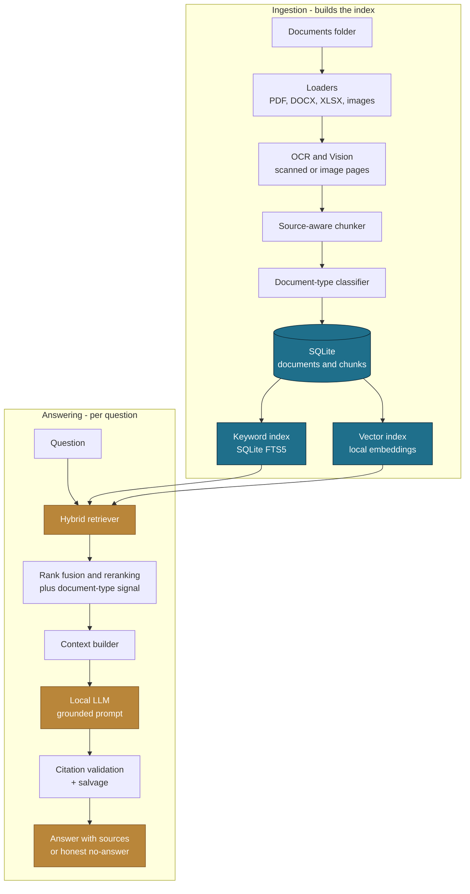
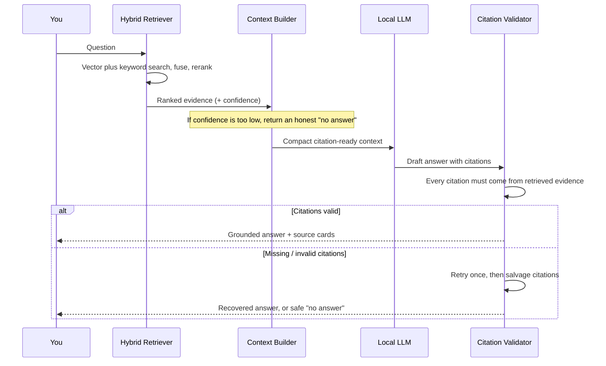

<div align="center">



<br/>

**A fully local, air-gapped Retrieval-Augmented Generation system that answers questions from your own documents — with citations, or an honest “no answer.”**

<br/>


-b9863a?style=flat-square)


</div>

---

> *In the myth, Ariadne gave Theseus a single thread to find his way out of the Labyrinth.*
> *This Ariadne does the same for your documents — it follows the thread of evidence to an answer, and never loses the way back to the source.*

---

## Table of contents

- [What is Ariadne](#what-is-ariadne)
- [Highlights](#highlights)
- [Screenshots](#screenshots)
- [How it works](#how-it-works)
- [The answer pipeline](#the-answer-pipeline)
- [Project structure](#project-structure)
- [Requirements](#requirements)
- [Quick start (Windows)](#quick-start-windows)
- [Manual setup (any platform)](#manual-setup-any-platform)
- [Running fully air-gapped](#running-fully-air-gapped)
- [Configuration](#configuration)
- [Using Ariadne](#using-ariadne)
- [Command-line interface](#command-line-interface)
- [Testing](#testing)
- [Security & privacy](#security--privacy)
- [Troubleshooting](#troubleshooting)

---

## What is Ariadne

Ariadne is a knowledge-retrieval assistant that runs entirely on your own machine or local network. You point it at a folder of documents; it reads them, indexes them, and then answers questions about them in natural language — always grounded in the source material and always showing exactly which documents it drew from.

Nothing leaves the machine. The language model, the embeddings, the search index, and the database are all local. A built-in egress guard actively blocks any outbound network connection, so Ariadne is safe to run on isolated or sensitive networks.

**Ariadne is a good fit when you need to:**

- Search and question a private corpus without sending anything to the cloud.
- Get answers that are *traceable* — every claim points back to a source document.
- Deploy on an air-gapped or restricted network where external calls are not allowed.
- Run on a single workstation and optionally share it with colleagues over the LAN.

---

## Highlights

| Capability | What it means for you |
|---|---|
| **Fully local & air-gapped** | The model, index, and data never leave the machine. A runtime guard blocks all non-local network connections. |
| **Hybrid retrieval** | Combines semantic (meaning-based) vector search, exact keyword search, and a document-type signal, then fuses them into one ranked result. |
| **Grounded, cited answers** | Every answer is built from retrieved evidence and carries citations back to the source documents. |
| **Honest “no answer”** | When the evidence is too weak, Ariadne says so instead of guessing. |
| **Broad format support** | PDF, Word, PowerPoint, Excel, CSV, text, Markdown, JSON, images, and ZIP/RAR archives. |
| **OCR & vision (optional)** | Reads scanned pages and image-only PDFs via local OCR, and can caption images with a local vision model. |
| **Incremental ingestion** | Re-indexes only the files that changed; cleans up records for files you removed. |
| **Browser interface** | A clean local web UI for asking questions, plus an admin console for ingestion and index health. |
| **Configurable, no code changes** | Swap the model, tune retrieval, and change behavior from one YAML file or the settings panel. |

---

## Screenshots

<div align="center">

**Light theme**



<br/><br/>

**Dark theme**



</div>

---

## How it works

Ariadne has two stages: **ingestion** (done once per corpus, repeated when documents change) and **answering** (done per question). The diagram below shows the whole system.



**In plain terms:**

1. **Loaders** read each file format into clean text and records. Scanned pages and image-only PDFs are recovered with **OCR**, and images can optionally be **captioned** by a local vision model.
2. The **chunker** splits documents intelligently — keeping spreadsheet rows and captions whole, and splitting prose at headings and sentence boundaries with a small overlap so context is never cut mid-thought.
3. A **classifier** labels each document with a type (resume, form, report, …) so retrieval can later prefer the right kind of source.
4. Everything is stored in a local **SQLite** database, from which two indexes are built: a **keyword** index for exact matches and a **vector** index for meaning-based search.

---

## The answer pipeline

When you ask a question, Ariadne follows a strict, source-grounded path:



This is what makes Ariadne trustworthy: it **cannot cite a source it did not retrieve**, and it would rather decline than fabricate. A citation-salvage step even recovers good answers when the model forgets to attach its citation markers — without ever inventing a source.

---

## Project structure

```
ariadne/
├── backend/app/
│   ├── api/             # HTTP endpoints (chat, search, admin, config, status)
│   ├── core/            # Config, logging, air-gap enforcement, shared schemas
│   ├── ingestion/       # Loaders, chunker, document classifier, pipeline
│   ├── intake/          # Archive extraction + incremental change detection
│   ├── indexing/        # Local vector index + index status
│   ├── retrieval/       # Hybrid retriever, fusion, keyword index, reranker
│   ├── rag/             # Context builder, prompt, answer generator, citations
│   ├── embeddings/      # Local embedding model adapter
│   ├── ocr/  vision/    # Optional local OCR and image captioning
│   ├── llm/             # Local language-model client
│   ├── persistence/     # SQLite metadata store
│   ├── services/        # Admin ops, chat store, config overrides, status
│   ├── runtime/         # Shared app state + concurrency controls
│   └── ui/static/       # Bundled browser interface (HTML/CSS/JS)
├── scripts/             # Management CLI + standalone utilities
├── tests/  tools/       # Test suite and diagnostic tooling
├── config/              # client.yaml (baseline) + ui_overrides.yaml (UI-tuned)
├── data/input/          # Put your source documents here
├── storage/             # Generated: metadata.db, vector index, logs
├── setup.bat  ingest.bat  start.bat  start_lan.bat  stop.bat
└── requirements.txt
```

---

## Requirements

| Component | Requirement | Notes |
|---|---|---|
| **Python** | 3.11 or newer | Backend and CLI. |
| **Local LLM server** | [Ollama](https://ollama.com) (or any OpenAI-compatible local server) | Default model: `llama3.1:8b`. |
| **Embedding model** | `sentence-transformers/all-MiniLM-L6-v2` | Downloaded once, then cached. |
| **Reranker** *(optional)* | `cross-encoder/ms-marco-MiniLM-L-6-v2` | Improves ranking; downloaded once. |
| **Vision model** *(optional)* | `qwen2.5vl:7b` via Ollama | Only if image captioning is enabled. |
| **OCR engine** *(optional)* | [Tesseract OCR](https://github.com/tesseract-ocr/tesseract) | Only for scanned / image-only pages. |
| **GPU** *(recommended)* | NVIDIA GPU | Greatly speeds up the LLM and embeddings; CPU also works. |

Python dependencies (installed automatically) include **FastAPI**, **Uvicorn**, **Pydantic**, **sentence-transformers**, **NumPy**, **PyMuPDF**, **python-docx**, **python-pptx**, **openpyxl**, **pypdf**, **pytesseract**, and **Pillow**.

---

## Quick start (Windows)

Ariadne ships with one-click batch scripts. Run them in order:

```bat
:: 1. One-time setup — creates a virtual environment and installs dependencies
setup.bat

:: 2. Pull the local model (requires Ollama installed and running)
ollama pull llama3.1:8b

:: 3. Index your documents (place them in data\input first)
ingest.bat

:: 4. Launch Ariadne (opens your browser at http://127.0.0.1:8080)
start.bat
```

| Script | What it does |
|---|---|
| `setup.bat` | Creates `.venv` and installs all Python dependencies. **Run once.** |
| `ingest.bat` | Cleans, ingests + classifies your documents, then builds the keyword and vector indexes — in four visible phases. |
| `start.bat` | Starts the server on `127.0.0.1:8080` (this machine only) and opens the browser. |
| `start_lan.bat` | Starts on `0.0.0.0:8080` so other devices on your network can reach it, and prints the address to share. |
| `stop.bat` | Stops any Ariadne server running on port 8080. |

> **First ingestion is slower** than later ones: each document is read by the local model once to classify it, and every chunk is embedded. A few minutes for a few hundred documents is normal. The four phases are printed as they run, so you can always see progress.

---

## Manual setup (any platform)

```bash
# 1. Create and activate a virtual environment
python -m venv .venv
source .venv/bin/activate            # Windows: .venv\Scripts\activate

# 2. Install dependencies
pip install -r requirements.txt

# 3. Start your local model server and pull the model
ollama serve &
ollama pull llama3.1:8b

# 4. Put documents in data/input, then build the index
python scripts/manage_rag.py rebuild --fresh

# 5. Launch the server
python -m uvicorn backend.app.main:app --host 127.0.0.1 --port 8080
```

Then open **http://127.0.0.1:8080**.

---

## Running fully air-gapped

Ariadne is designed to run with **zero internet access**. The only things that ever need a connection are the *one-time downloads* of the software and models. After that, you can disconnect completely — and a runtime guard enforces it.

### What needs the internet (once)

| Item | Where it comes from | How to fetch |
|---|---|---|
| Python packages | PyPI | `pip install -r requirements.txt` |
| Language model | Ollama registry | `ollama pull llama3.1:8b` |
| Vision model *(optional)* | Ollama registry | `ollama pull qwen2.5vl:7b` |
| Embedding model | Hugging Face | downloaded on first ingest, then cached |
| Reranker *(optional)* | Hugging Face | downloaded on first run, then cached |
| Tesseract *(optional)* | Offline installer | install once from the project page |

### How to deploy onto an isolated machine

1. **Prepare on a connected machine.** Run `setup.bat`, pull the Ollama models, and run one ingest so the Hugging Face models download into the local cache (`~/.cache/huggingface`, or wherever `HF_HOME` points).
2. **Transfer everything.** Copy to the target machine:
   - the project folder (including `.venv`),
   - the **Ollama models** (Ollama's model directory),
   - the **Hugging Face cache** directory.
3. **Go offline.** On the target machine there is nothing left to download.

### The guarantee

On startup Ariadne sets offline flags for its ML libraries and installs an **egress guard** that intercepts every outbound socket connection. Loopback and local-network addresses are allowed; **everything else is blocked** and raises an error. This means that even a misbehaving third-party library cannot phone home. You can verify the posture at the `/health` endpoint, and the behavior is covered by automated tests.

> With `app.offline_mode: true` (the default) and external calls disabled, Ariadne will refuse to talk to any non-local address — by design.

---

## Configuration

All settings live in **`config/client.yaml`**. The browser's **Display / settings panel** writes a small set of safe tuning values to `config/ui_overrides.yaml`, which is layered on top of the baseline — so you never have to hand-edit the main file for everyday tuning.

A few of the most useful settings:

```yaml
llm:
  base_url: "http://localhost:11434/v1"   # your local model server
  model: "llama3.1:8b"                     # swap the model here — no code change

embeddings:
  model_name_or_path: "sentence-transformers/all-MiniLM-L6-v2"

retrieval:
  fusion_method: "rrf"                     # how vector + keyword results combine
  rerank_enabled: true                     # cross-encoder reranking of the top pool

ocr:
  enabled: true                            # read scanned / image-only pages

vision:
  enabled: true                            # caption images with a local vision model

app:
  offline_mode: true                       # enforce the air-gapped posture
```

Changing the model is a one-line edit. Because embeddings are kept separate from the answering model, you can swap the language model without re-indexing your documents.

---

## Using Ariadne

### The web interface

- **Home** — ask a question and get a grounded answer with source cards. Choose an answer style (brief, balanced, detailed) and scope the search.
- **Threads** — every conversation is saved locally and kept in its own thread; revisit or clear them at any time.
- **Sources** — search the evidence directly, without generating an answer.
- **Admin ("The Loom")** — run ingestion and rebuilds, watch index readiness, and manage local models, all from the browser.

### Sharing on a LAN

Run `start_lan.bat` (or start Uvicorn with `--host 0.0.0.0`). The script prints the address other devices can use, e.g. `http://192.168.1.20:8080`. If a device cannot connect, allow the server through the host firewall for private networks.

---

## Command-line interface

Everything the UI does is also available from `scripts/manage_rag.py`:

```bash
# Build everything from scratch (clean, ingest, keyword index, vector index)
python scripts/manage_rag.py rebuild --fresh

# Incremental ingest (only new/changed files)
python scripts/manage_rag.py ingest

# Build indexes individually
python scripts/manage_rag.py build-keyword-index
python scripts/manage_rag.py build-index

# Inspect what was ingested
python scripts/manage_rag.py status
python scripts/manage_rag.py count
python scripts/manage_rag.py inspect-metadata

# Ask a question from the terminal
python scripts/manage_rag.py rag-answer --query "your question here"
```

Standalone helpers in `scripts/` let you test the model connection (`test_llm.py`), OCR (`test_ocr.py`), vision (`test_vision.py`), and run a full deployment check (`smoke_test.py`).

---

## Testing

The backend ships with a model-free test suite that runs in seconds and needs no downloads:

```bash
python tests/run_all.py
```

It covers the chunker, the fusion math and retriever wiring, document-type classification, the answer generator, citation validation, and citation salvage. For end-to-end quality checks against a running instance, see `tools/rag_eval.py`.

---

## Security & privacy

- **No external calls.** All inference, search, and storage are local. The egress guard blocks non-local connections at runtime.
- **Your data stays put.** Documents, the database, and the indexes live under your project folder; nothing is uploaded.
- **Traceable answers.** Every answer is tied to the specific sources it used, so claims can always be checked.
- **LAN-aware.** When shared on a network, model and service endpoints are validated to stay within the local boundary.

---

## Troubleshooting

| Symptom | Likely cause & fix |
|---|---|
| `Python not found` from a script | Run `setup.bat` first; it creates the `.venv` the other scripts use. |
| Keyword/Vector index shows **"Not built"** | A previous index build didn't finish. Re-run `ingest.bat` and let all four phases complete. |
| Ingestion fails immediately | The local model server isn't running. Start it with `ollama serve` and confirm the model is pulled. |
| Vector index build fails | The embedding model isn't cached yet. On a connected machine, run one ingest to download it (see [air-gapped](#running-fully-air-gapped)). |
| Browser shows the old theme after an update | Hard-refresh the page (`Ctrl`+`F5`) to clear the cached stylesheet. |
| Port 8080 already in use | Run `stop.bat`, or start on a different port. |

---

<div align="center">

<br/>

**Ariadne** · *Follow the thread.*

<sub>A local-first, air-gapped retrieval system. Built to be traceable, private, and honest about what it knows.</sub>

</div>
